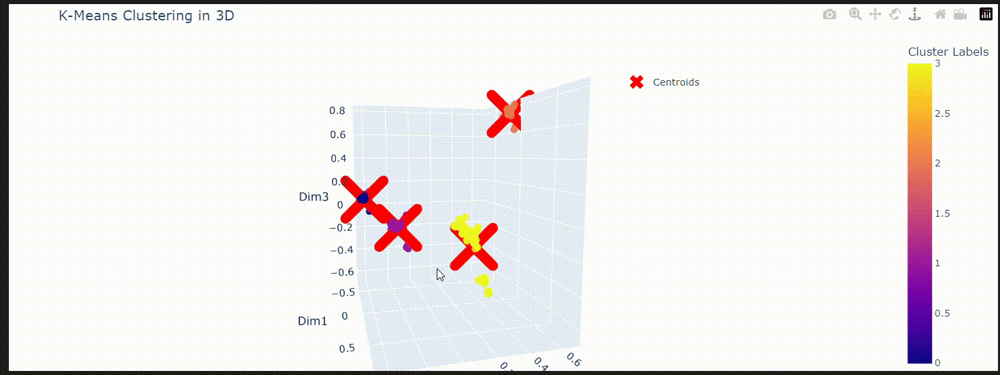

# **ADM-Hw4 
**Movie Recommendation System**
*Madina Rakhimbayeva 2189800

## **Project objectives:**

The goal of this project is to develop a **Recommender System** that is able to recommend movies based on similar users.

Then it is required to implement by scratch three versions of the **K-Means** algorithm, and determined the optimal number of clusters.

All the data was downloaded from this [Kaggle dataset](https://www.kaggle.com/datasets/grouplens/movielens-20m-dataset?select=rating.csv).
___

  

 

____

## **Project Structure**
___
- In this repository you can find:
 * **main.ipynb**: Jupyter Notebook containing all the answers and the explanations to the Research and Algorithmic Questions.
 * **functions.py**: A file containing of all used function.
 * **assets/**: A directory file to store generated Gifs

  - In `main.ipynb` there is also an interactive 3D scatter plot using the *Plotly* module *Express*
      
  

  

   

